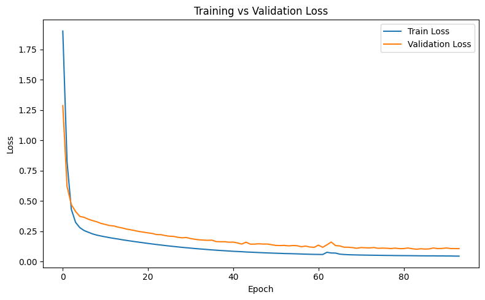

# Multiclass Digit Classification (UCI Digits)

## Problem
Classify handwritten digits (0–9) using:
- Logistic Regression
- Deep Neural Network (128-64-32)

## Dataset
- 1797 samples
- 10 classes
- 8x8 grayscale images

## Results

| Model | Train Accuracy | Test Accuracy |
|-------|----------------|---------------|
| Logistic Regression | 0.95 | 0.94 |
| Neural Network | 0.976 | 0.972 |

## Training Curve

## Accuracy Curve

## Confusion Matrix

## Key Observations
- Increased model capacity reduced underfitting
- L2 regularization balanced bias-variance
- Final generalization gap < 1%
